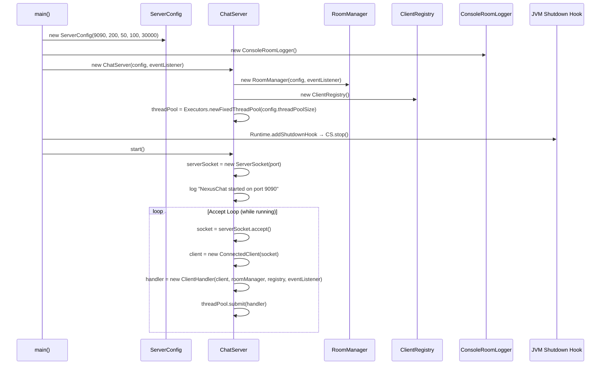
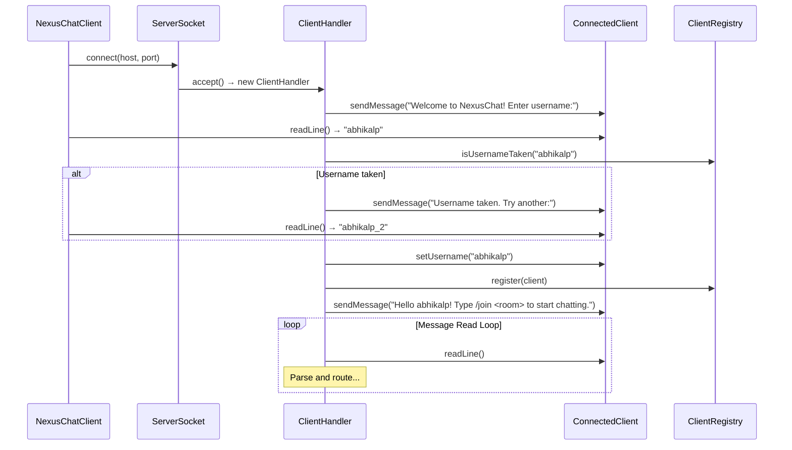
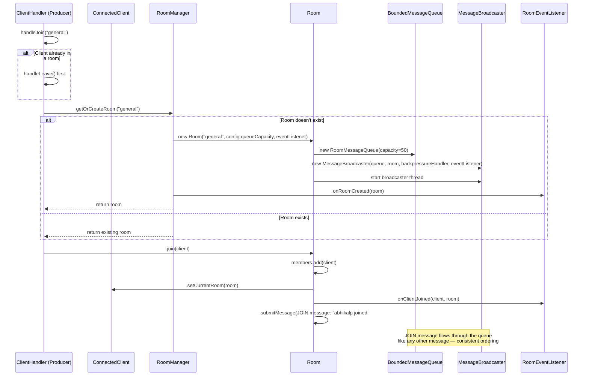
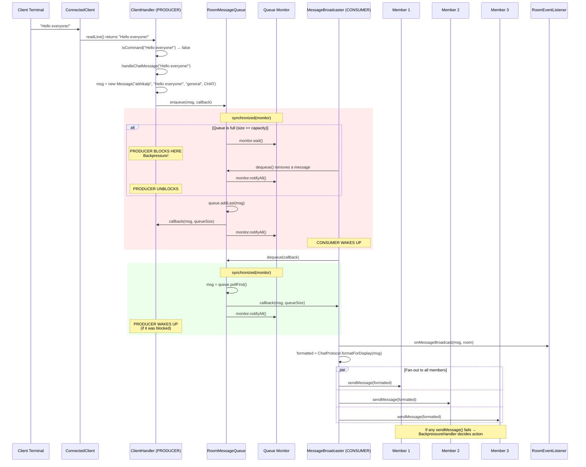
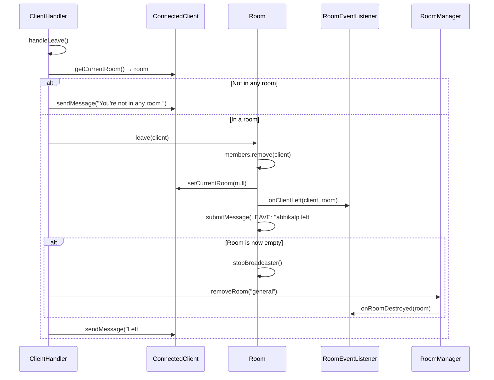
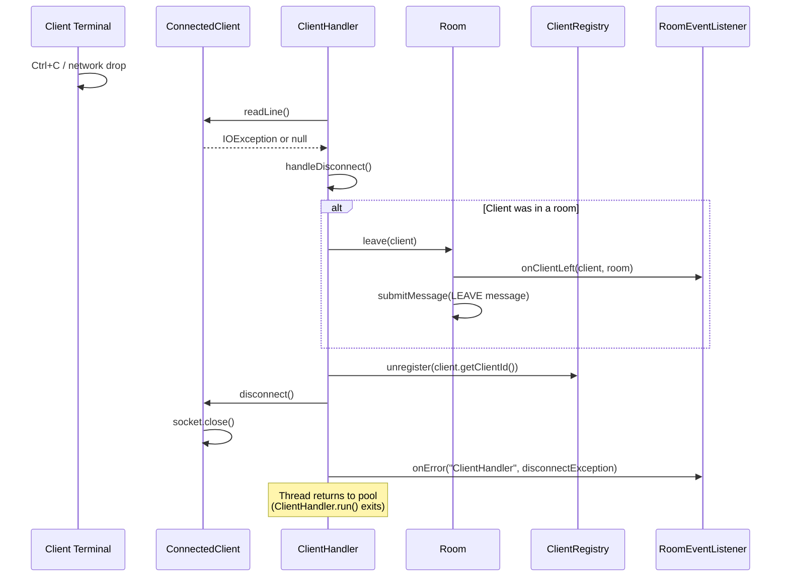
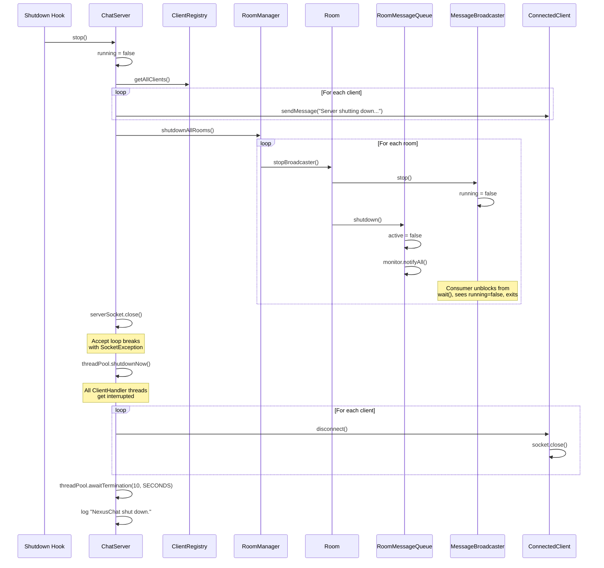
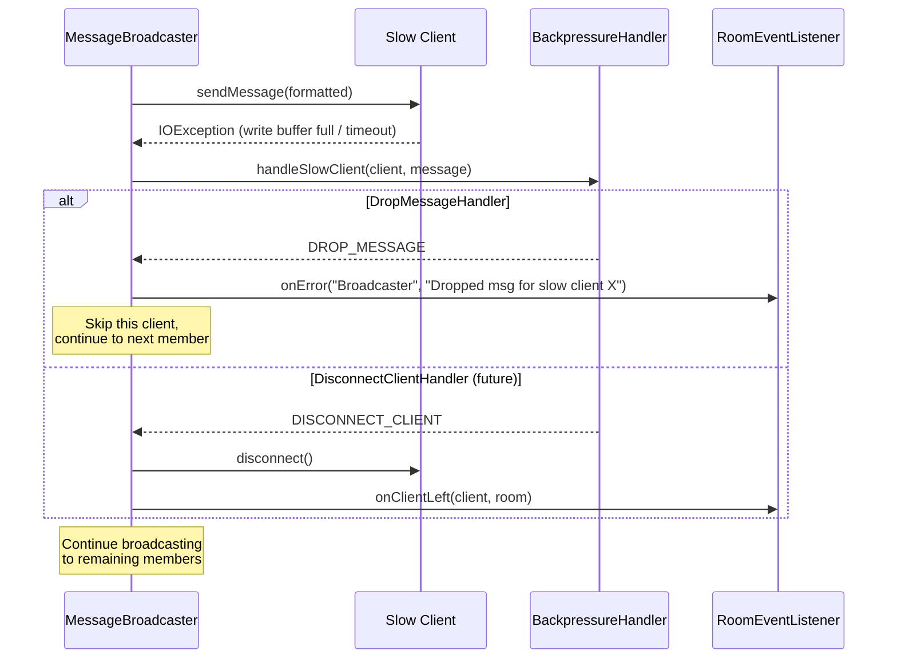

# NexusChat - Flow Diagrams

---

## 1. Server Startup Flow

---

## 2. Client Connection & Registration Flow

---

## 3. Join Room Flow

---

## 4. Chat Message Flow (Core Producer-Consumer)

---

## 5. Leave Room Flow

---

## 6. Client Disconnect Flow (Abrupt)

---

## 7. Graceful Server Shutdown Flow

---

## 8. Backpressure Flow (Slow Client)

