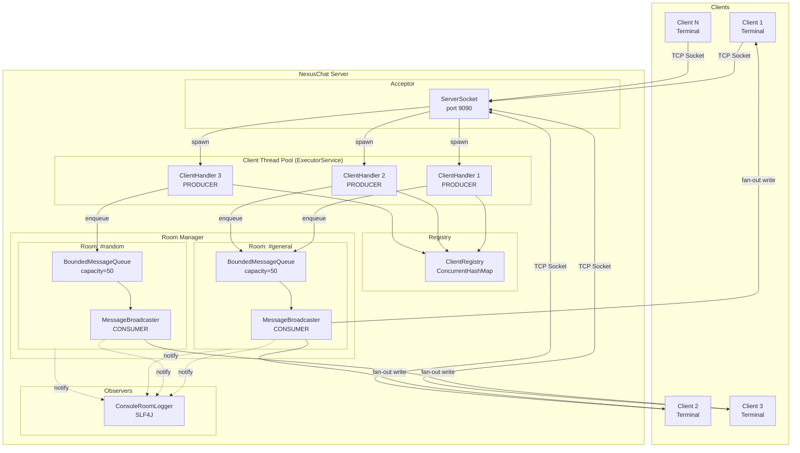

# NexusChat - High Level Design (HLD)

---

## 1. System Overview

NexusChat is a **concurrent multi-room chat server** built in Java that demonstrates
real-world application of the producer-consumer pattern, thread synchronization,
and design patterns (Observer, Strategy, Dependency Inversion).

**Core idea:** Multiple clients connect via TCP sockets. Each client's reader thread
acts as a **producer** — reading messages and pushing them into a per-room bounded queue.
A **consumer** thread per room dequeues messages and fans them out to all room members.
The bounded queue provides natural **backpressure** when message volume exceeds
processing capacity.

---

## 2. Architecture Diagram



---

## 3. Component Breakdown

### 3.1 Server Component
- **ChatServer**: Entry point. Runs an accept-loop on `ServerSocket`. For each incoming
  connection, wraps it in a `ConnectedClient` and submits a `ClientHandler` to the
  thread pool. Owns the `RoomManager` and `ClientRegistry`.
- **ServerConfig**: Immutable config — port, max clients, queue capacity, pool size.

### 3.2 Client Management Component
- **ConnectedClient**: Encapsulates a single TCP connection. Provides thread-safe
  `sendMessage()` (synchronized on writer) and blocking `readLine()`.
- **ClientRegistry**: Global lookup of all connected clients. Thread-safe via
  `ConcurrentHashMap`. Enforces unique usernames.
- **ClientHandler (PRODUCER)**: One per client. Reads lines from socket in a loop,
  parses commands, and for chat messages — creates a `Message` and enqueues it
  into the client's current room's bounded queue.

### 3.3 Room Component
- **Room**: The shared resource. Holds a member list (`CopyOnWriteArrayList`),
  a `BoundedMessageQueue`, and a `MessageBroadcaster` thread. Provides `join()`,
  `leave()`, `submitMessage()`.
- **RoomManager**: Lifecycle management. Creates rooms on first join (lazy),
  tracks all rooms in `ConcurrentHashMap`. Can destroy empty rooms.

### 3.4 Message Pipeline Component (Producer-Consumer Core)
- **BoundedMessageQueue (interface)**: Strategy pattern — defines enqueue/dequeue
  with callbacks.
- **RoomMessageQueue (implementation)**: Uses `synchronized` + `wait()/notifyAll()`
  on a monitor object. Bounded capacity. When full, producer blocks. When empty,
  consumer blocks. Direct evolution of the assignment's `SharedQueue`.
- **MessageBroadcaster (CONSUMER)**: One per room. Dequeue loop — takes a message,
  fans it out to all room members by calling `sendMessage()` on each `ConnectedClient`.

### 3.5 Backpressure Component
- **BackpressureHandler (interface)**: Strategy for slow clients.
- **DropMessageHandler**: Default — drops the message for that specific client, logs it.

### 3.6 Observer Component
- **RoomEventListener (interface)**: Observer pattern — callbacks for join, leave,
  message broadcast, room created/destroyed, errors.
- **ConsoleRoomLogger**: Logs all events via SLF4J.

### 3.7 Protocol Component
- **ChatProtocol**: Static encode/decode utility. Pipe-delimited text format.
  Also handles command parsing (`/join`, `/leave`, etc.)
- **Message + MessageType**: Immutable data objects.

### 3.8 CLI Client
- **NexusChatClient**: Standalone Java app. Connects to server via TCP.
  Spawns a reader thread for incoming messages, main thread reads console and sends.

---

## 4. Key Design Decisions

| Decision | Rationale |
|---|---|
| **Thread-per-client** (not NIO) | Simpler mental model, directly maps to producer-consumer pattern. NIO is an optimization for 10K+ connections — our target is hundreds |
| **One queue per room** (not global) | Rooms are independent — a busy room shouldn't block a quiet one. Per-room queues isolate backpressure |
| **One broadcaster per room** (not shared pool) | Simplifies ordering — messages in a room are always delivered in enqueue order. No cross-room coordination needed |
| **CopyOnWriteArrayList for members** | Reads (broadcaster iterating) vastly outnumber writes (join/leave). COW is ideal for this read-heavy pattern |
| **ConcurrentHashMap for rooms/clients** | Lock-free reads, segment-level locking for writes. No global lock bottleneck |
| **Bounded queue with blocking** | Natural backpressure — if room is flooded, producers (client handlers) block, which naturally slows down that client's message acceptance. The client's TCP buffer fills, and the OS handles flow control |
| **Observer for logging** | Decouples monitoring from business logic. Easy to swap in metrics, file logging, alerting |
| **Strategy for queue + backpressure** | Can swap implementations without changing producers/consumers. Makes testing easy |

---

## 5. Scalability Characteristics

```
Bottleneck analysis:

1. Accept loop (single thread)
   → Not a bottleneck: accept() is fast, actual work is in the pool

2. Client thread pool (fixed size)
   → Controls max concurrent clients
   → If pool exhausted: new connections queue up in ServerSocket backlog

3. Per-room bounded queue
   → If room gets flooded: producers block (backpressure)
   → Queue capacity is configurable per ServerConfig

4. Broadcaster thread (one per room)
   → Fan-out is O(members) per message
   → Slow client detection prevents one client from blocking delivery to others

5. ConnectedClient.sendMessage() (synchronized)
   → Only contention point: broadcaster + system messages to same client
   → Short critical section (single write call)
```

### Capacity targets
- **200+ simultaneous clients** across multiple rooms
- **Sub-5ms message latency** under normal load
- **Graceful degradation** under heavy load (backpressure, not crash)

---

## 6. Failure Modes & Handling

| Failure | Detection | Recovery |
|---|---|---|
| Client disconnects abruptly | `IOException` on read/write | `ClientHandler` catches, calls `room.leave()`, `registry.unregister()`, closes socket |
| Slow client (can't keep up) | Write throws or times out | `BackpressureHandler` decides: drop message or disconnect |
| Room queue full | Producer blocks on `enqueue()` | Blocks naturally — TCP flow control propagates backpressure to client |
| Thread pool exhausted | New connections wait in backlog | `ServerSocket` backlog queue (OS-level). Logged as warning |
| Server shutdown | `Runtime.addShutdownHook()` | Stop accepting, broadcast shutdown notice, drain queues, close all sockets, shutdown pools |

---

## 7. Technology Stack

| Layer | Technology |
|---|---|
| Language | Java 17 |
| Build | Gradle (Groovy DSL) |
| Networking | `java.net.ServerSocket` / `java.net.Socket` (blocking I/O) |
| Concurrency | `java.util.concurrent` (ExecutorService, ConcurrentHashMap, CopyOnWriteArrayList, AtomicInteger) + `synchronized`/`wait`/`notifyAll` |
| Logging | SLF4J + Logback |
| Testing | JUnit 5 |
| CLI Client | `java.net.Socket` + `System.in` reader |
