# NexusChat - Low Level Design (LLD)

---

## 1. Class Diagram

```mermaid
classDiagram
    direction TB

    %% ─── Entry Point ───
    class NexusChatServer {
        +main(String[] args) void
    }

    %% ─── Server Layer ───
    class ChatServer {
        -ServerSocket serverSocket
        -ExecutorService clientThreadPool
        -RoomManager roomManager
        -ClientRegistry clientRegistry
        -RoomEventListener eventListener
        -volatile boolean running
        +start() void
        +stop() void
        -acceptConnections() void
    }

    class ServerConfig {
        +int port
        +int maxClients
        +int roomQueueCapacity
        +int threadPoolSize
        +long clientTimeoutMs
        +ServerConfig()
        +ServerConfig(int port, int maxClients, int roomQueueCapacity, int threadPoolSize, long clientTimeoutMs)
    }

    %% ─── Client Layer ───
    class ConnectedClient {
        -String clientId
        -String username
        -Socket socket
        -BufferedReader reader
        -PrintWriter writer
        -Room currentRoom
        -volatile boolean connected
        +sendMessage(String raw) void
        +readLine() String
        +disconnect() void
        +getClientId() String
        +getUsername() String
        +setUsername(String) void
        +getCurrentRoom() Room
        +setCurrentRoom(Room) void
        +isConnected() boolean
    }

    class ClientRegistry {
        -ConcurrentHashMap~String, ConnectedClient~ clients
        +register(ConnectedClient) boolean
        +unregister(String clientId) void
        +getByUsername(String) ConnectedClient
        +getByClientId(String) ConnectedClient
        +getAllClients() Collection~ConnectedClient~
        +isUsernameTaken(String) boolean
        +getOnlineCount() int
    }

    class ClientHandler {
        <<Runnable>>
        -ConnectedClient client
        -RoomManager roomManager
        -ClientRegistry clientRegistry
        -ChatProtocol protocol
        -RoomEventListener eventListener
        +run() void
        -handleCommand(String input) void
        -handleJoin(String roomName) void
        -handleLeave() void
        -handleListRooms() void
        -handleListUsers() void
        -handleQuit() void
        -handleChatMessage(String content) void
        -sendSystemMessage(String text) void
    }

    %% ─── Room Layer ───
    class Room {
        -String name
        -CopyOnWriteArrayList~ConnectedClient~ members
        -BoundedMessageQueue messageQueue
        -MessageBroadcaster broadcaster
        -Thread broadcasterThread
        -List~RoomEventListener~ observers
        -AtomicInteger messageCount
        +join(ConnectedClient) void
        +leave(ConnectedClient) void
        +submitMessage(Message) void
        +getMembers() List~ConnectedClient~
        +getMemberCount() int
        +getName() String
        +getMessageCount() int
        +startBroadcaster() void
        +stopBroadcaster() void
        +addObserver(RoomEventListener) void
    }

    class RoomManager {
        -ConcurrentHashMap~String, Room~ rooms
        -ServerConfig config
        -RoomEventListener eventListener
        +getOrCreateRoom(String name) Room
        +getRoom(String name) Room
        +removeRoom(String name) void
        +listRoomNames() Set~String~
        +getRoomInfo() Map~String, Integer~
        +shutdownAllRooms() void
    }

    %% ─── Message Layer ───
    class Message {
        -String sender
        -String content
        -String roomName
        -MessageType type
        -Instant timestamp
        -String messageId
        +Message(String sender, String content, String roomName, MessageType type)
        +getSender() String
        +getContent() String
        +getRoomName() String
        +getType() MessageType
        +getTimestamp() Instant
        +getMessageId() String
    }

    class MessageType {
        <<enumeration>>
        CHAT
        JOIN
        LEAVE
        SYSTEM
        BROADCAST
    }

    class ChatProtocol {
        +static String DELIMITER
        +static encode(Message) String
        +static decode(String raw) Message
        +static formatForDisplay(Message) String
        +static isCommand(String input) boolean
        +static parseCommand(String input) String[]
    }

    %% ─── Queue Layer (Producer-Consumer Core) ───
    class BoundedMessageQueue {
        <<interface>>
        +enqueue(Message, BiConsumer~Message, Integer~) void
        +dequeue(BiConsumer~Message, Integer~) Message
        +size() int
        +isEmpty() boolean
        +isFull() boolean
        +getCapacity() int
        +getQueueStatus() String
        +shutdown() void
    }

    class RoomMessageQueue {
        -int capacity
        -Object monitor
        -Deque~Message~ queue
        -volatile boolean active
        +enqueue(Message, BiConsumer~Message, Integer~) void
        +dequeue(BiConsumer~Message, Integer~) Message
        +size() int
        +isEmpty() boolean
        +isFull() boolean
        +getCapacity() int
        +getQueueStatus() String
        +shutdown() void
    }

    %% ─── Broadcast Layer (Consumer Side) ───
    class MessageBroadcaster {
        <<Runnable>>
        -BoundedMessageQueue messageQueue
        -Room room
        -BackpressureHandler backpressureHandler
        -RoomEventListener eventListener
        -volatile boolean running
        +run() void
        +stop() void
        -broadcastToMembers(Message, List~ConnectedClient~) void
        -deliverToClient(ConnectedClient, String) void
    }

    class BackpressureHandler {
        <<interface>>
        +handleSlowClient(ConnectedClient, Message) SlowClientAction
    }

    class SlowClientAction {
        <<enumeration>>
        DROP_MESSAGE
        DISCONNECT_CLIENT
        RETRY_ONCE
    }

    class DropMessageHandler {
        +handleSlowClient(ConnectedClient, Message) SlowClientAction
    }

    %% ─── Observer Layer ───
    class RoomEventListener {
        <<interface>>
        +onClientJoined(ConnectedClient, Room) void
        +onClientLeft(ConnectedClient, Room) void
        +onMessageBroadcast(Message, Room) void
        +onRoomCreated(Room) void
        +onRoomDestroyed(Room) void
        +onError(String source, Exception e) void
    }

    class ConsoleRoomLogger {
        -Logger logger
        +onClientJoined(ConnectedClient, Room) void
        +onClientLeft(ConnectedClient, Room) void
        +onMessageBroadcast(Message, Room) void
        +onRoomCreated(Room) void
        +onRoomDestroyed(Room) void
        +onError(String source, Exception e) void
    }

    %% ─── Exception Layer ───
    class ChatException {
        +ChatException(String message)
        +ChatException(String message, Throwable cause)
    }

    class RoomFullException {
        +RoomFullException(String roomName)
    }

    class ClientDisconnectedException {
        +ClientDisconnectedException(String clientId)
    }

    %% ─── CLI Client ───
    class NexusChatClient {
        -Socket socket
        -BufferedReader serverReader
        -PrintWriter serverWriter
        -BufferedReader consoleReader
        -volatile boolean running
        +connect(String host, int port) void
        +disconnect() void
        -startReaderThread() void
        -startWriterLoop() void
    }

    %% ════════════════════════════════
    %% RELATIONSHIPS
    %% ════════════════════════════════

    NexusChatServer --> ChatServer : creates
    NexusChatServer --> ServerConfig : creates

    ChatServer --> ServerConfig : uses
    ChatServer --> RoomManager : owns
    ChatServer --> ClientRegistry : owns
    ChatServer --> ClientHandler : spawns per client
    ChatServer --> RoomEventListener : uses

    ClientHandler --> ConnectedClient : reads from (PRODUCER)
    ClientHandler --> RoomManager : routes commands
    ClientHandler --> ClientRegistry : registers/unregisters
    ClientHandler --> ChatProtocol : parses messages

    Room --> BoundedMessageQueue : has one
    Room --> MessageBroadcaster : has one (CONSUMER)
    Room --> ConnectedClient : has many members
    Room --> RoomEventListener : notifies

    RoomManager --> Room : manages many
    RoomManager --> ServerConfig : uses config

    MessageBroadcaster --> BoundedMessageQueue : dequeues from
    MessageBroadcaster --> BackpressureHandler : delegates slow clients
    MessageBroadcaster --> RoomEventListener : notifies

    RoomMessageQueue ..|> BoundedMessageQueue : implements
    ConsoleRoomLogger ..|> RoomEventListener : implements
    DropMessageHandler ..|> BackpressureHandler : implements

    ClientHandler --> Room : enqueues messages (PRODUCER)
    Message --> MessageType : has

    ChatException <|-- RoomFullException
    ChatException <|-- ClientDisconnectedException
```



---

## 2. Class Inventory

### 2.1 Entry Point

| Class | Responsibility |
|---|---|
| `NexusChatServer` | `main()` — creates `ServerConfig`, `ChatServer`, starts the server, registers shutdown hook |

### 2.2 Server Layer

| Class | Responsibility |
|---|---|
| `ChatServer` | Owns `ServerSocket`, accepts connections in a loop, spawns `ClientHandler` per connection via thread pool, coordinates startup/shutdown |
| `ServerConfig` | Immutable config holder — port, max clients, queue capacity, thread pool size, client timeout |

### 2.3 Client Layer

| Class | Responsibility |
|---|---|
| `ConnectedClient` | Wraps a `Socket` — provides `sendMessage()` and `readLine()`, holds username, current room reference, connection state |
| `ClientRegistry` | Thread-safe registry (`ConcurrentHashMap`) of all connected clients. Lookup by username or ID. Enforces unique usernames |
| `ClientHandler` | **PRODUCER role.** Runnable that loops reading lines from client socket. Parses commands (`/join`, `/leave`, `/rooms`, `/users`, `/quit`). For chat messages, wraps in `Message` and enqueues to the client's current room queue |

### 2.4 Room Layer

| Class | Responsibility |
|---|---|
| `Room` | Shared resource. Holds member list (`CopyOnWriteArrayList`), a `BoundedMessageQueue`, and a `MessageBroadcaster` thread. Provides `join()`, `leave()`, `submitMessage()` |
| `RoomManager` | Thread-safe room lifecycle (`ConcurrentHashMap`). Creates rooms on first join, optionally destroys empty rooms |

### 2.5 Message Layer

| Class | Responsibility |
|---|---|
| `Message` | Immutable data object — sender, content, roomName, type, timestamp, messageId |
| `MessageType` | Enum — `CHAT`, `JOIN`, `LEAVE`, `SYSTEM`, `BROADCAST` |
| `ChatProtocol` | Static utility — `encode(Message) → String`, `decode(String) → Message`, `isCommand()`, `parseCommand()`. Defines the wire format between client and server |

### 2.6 Queue Layer (Producer-Consumer Core)

| Class | Responsibility |
|---|---|
| `BoundedMessageQueue` | **Interface** (Strategy pattern). Defines `enqueue()`, `dequeue()` with callbacks, `size()`, `isFull()`, `shutdown()` |
| `RoomMessageQueue` | **Implementation.** Uses `synchronized` + `wait()/notifyAll()` on a monitor object. Direct evolution of `SharedQueue` from assignment. Bounded capacity. `shutdown()` wakes blocked threads |

### 2.7 Broadcast Layer (Consumer Side)

| Class | Responsibility |
|---|---|
| `MessageBroadcaster` | **CONSUMER role.** Runnable that loops calling `dequeue()` on the room's queue. For each message, iterates room members and writes the formatted message to each client's socket. Uses `BackpressureHandler` for slow clients |
| `BackpressureHandler` | **Interface** (Strategy pattern). Decides what to do when a client can't receive fast enough |
| `DropMessageHandler` | Default implementation — drops the message for that client, logs a warning |
| `SlowClientAction` | Enum — `DROP_MESSAGE`, `DISCONNECT_CLIENT`, `RETRY_ONCE` |

### 2.8 Observer Layer

| Class | Responsibility |
|---|---|
| `RoomEventListener` | **Interface** (Observer pattern). Callbacks for `onClientJoined`, `onClientLeft`, `onMessageBroadcast`, `onRoomCreated`, `onRoomDestroyed`, `onError` |
| `ConsoleRoomLogger` | Implementation — logs all events via SLF4J |

### 2.9 Exception Layer

| Class | Responsibility |
|---|---|
| `ChatException` | Base unchecked exception for all chat errors |
| `RoomFullException` | Thrown when room membership exceeds limit (future use) |
| `ClientDisconnectedException` | Thrown when writing to a disconnected client |

### 2.10 CLI Client

| Class | Responsibility |
|---|---|
| `NexusChatClient` | Standalone CLI client. Connects via TCP socket. Reader thread prints incoming messages. Main thread reads console input and sends to server |

---

## 3. Thread Model

```
┌─────────────────────────────────────────────────────────────────────┐
│                        NEXUSCHAT SERVER                             │
│                                                                     │
│  ┌──────────────┐                                                   │
│  │  Main Thread  │  Accepts connections via ServerSocket.accept()    │
│  │  (Acceptor)   │  Creates ConnectedClient + submits ClientHandler  │
│  └──────┬───────┘  to thread pool                                   │
│         │                                                           │
│         ▼                                                           │
│  ┌──────────────────────────────────────────────────────────┐       │
│  │              Client Thread Pool (ExecutorService)         │       │
│  │  ┌──────────────┐ ┌──────────────┐ ┌──────────────┐     │       │
│  │  │ClientHandler │ │ClientHandler │ │ClientHandler │ ... │       │
│  │  │ (PRODUCER)   │ │ (PRODUCER)   │ │ (PRODUCER)   │     │       │
│  │  │ reads from   │ │ reads from   │ │ reads from   │     │       │
│  │  │ client sock  │ │ client sock  │ │ client sock  │     │       │
│  │  │ enqueues to  │ │ enqueues to  │ │ enqueues to  │     │       │
│  │  │ room queue   │ │ room queue   │ │ room queue   │     │       │
│  │  └──────┬───────┘ └──────┬───────┘ └──────┬───────┘     │       │
│  └─────────┼────────────────┼────────────────┼──────────────┘       │
│            │                │                │                      │
│            ▼                ▼                ▼                      │
│  ┌──────────────────────────────────────────────────────────┐       │
│  │              Per-Room Bounded Message Queues              │       │
│  │                                                           │       │
│  │  ┌─────────────────┐  ┌─────────────────┐               │       │
│  │  │ Room "general"  │  │ Room "random"   │  ...           │       │
│  │  │ Queue [3/50]    │  │ Queue [0/50]    │               │       │
│  │  │ ┌─┬─┬─┬─┬─┬─┐  │  │ ┌─┬─┬─┬─┬─┬─┐  │               │       │
│  │  │ │M│M│M│ │ │ │  │  │ │ │ │ │ │ │ │  │               │       │
│  │  │ └─┴─┴─┴─┴─┴─┘  │  │ └─┴─┴─┴─┴─┴─┘  │               │       │
│  │  └────────┬────────┘  └────────┬────────┘               │       │
│  └───────────┼─────────────────────┼────────────────────────┘       │
│              │                     │                                │
│              ▼                     ▼                                │
│  ┌──────────────────────────────────────────────────────────┐       │
│  │              Broadcaster Threads (one per room)           │       │
│  │  ┌───────────────────┐  ┌───────────────────┐            │       │
│  │  │ MessageBroadcaster│  │ MessageBroadcaster│  ...       │       │
│  │  │ (CONSUMER)        │  │ (CONSUMER)        │            │       │
│  │  │ dequeues message  │  │ dequeues message  │            │       │
│  │  │ fans out to all   │  │ fans out to all   │            │       │
│  │  │ room members      │  │ room members      │            │       │
│  │  └───────────────────┘  └───────────────────┘            │       │
│  └──────────────────────────────────────────────────────────┘       │
│                                                                     │
│  ┌──────────────┐                                                   │
│  │ Shutdown Hook │  Graceful shutdown — stops accepting, drains     │
│  │   Thread      │  queues, disconnects clients, shuts down pools   │
│  └──────────────┘                                                   │
└─────────────────────────────────────────────────────────────────────┘
```

### Thread count formula:
```
Total threads = 1 (acceptor) + N (client handlers) + R (broadcaster per room) + 1 (shutdown hook)

Where:
  N = number of connected clients (bounded by threadPoolSize)
  R = number of active rooms
```

---

## 4. Concurrency Mechanisms by Class

| Class | Mechanism | Why |
|---|---|---|
| `RoomMessageQueue` | `synchronized` + `wait()/notifyAll()` on monitor | Producer blocks when queue full, consumer blocks when empty |
| `Room.members` | `CopyOnWriteArrayList` | Broadcaster iterates while clients join/leave — COW avoids `ConcurrentModificationException` |
| `RoomManager.rooms` | `ConcurrentHashMap` | Rooms created/destroyed from multiple client handler threads |
| `ClientRegistry.clients` | `ConcurrentHashMap` | Clients register/unregister from multiple threads |
| `ConnectedClient.connected` | `volatile boolean` | Visibility across handler and broadcaster threads |
| `Room.messageCount` | `AtomicInteger` | Lock-free counter, read from multiple threads |
| `MessageBroadcaster.running` | `volatile boolean` | Visibility for shutdown signal |
| `ChatServer.running` | `volatile boolean` | Visibility for shutdown signal |
| `ConnectedClient.sendMessage()` | `synchronized` on writer | Multiple threads may write to same client (broadcaster + system messages) |

---

## 5. Design Patterns Applied

| Pattern | Where | Purpose |
|---|---|---|
| **Producer-Consumer** | `ClientHandler` → `RoomMessageQueue` → `MessageBroadcaster` | Core architecture — decouple message ingestion from delivery |
| **Observer** | `RoomEventListener` / `ConsoleRoomLogger` | Decouple event logging from business logic |
| **Strategy** | `BoundedMessageQueue` interface, `BackpressureHandler` interface | Swap queue impl or backpressure policy without changing consumers |
| **Dependency Inversion** | All constructors accept interfaces | Testability and flexibility |
| **Facade** | `RoomManager` | Simplifies room lifecycle for `ClientHandler` |

---

## 6. Wire Protocol

Simple text-based, one message per line, pipe-delimited:

```
Format:  TYPE|sender|roomName|content

Examples:
  CHAT|abhikalp|general|Hello everyone!
  JOIN|abhikalp|general|
  LEAVE|abhikalp|general|
  SYSTEM|server|general|Welcome to #general
  BROADCAST|server||Server shutting down in 60s
```

### Client Commands (sent as raw text, not encoded):
```
/join <roomName>     — Join or create a room
/leave               — Leave current room
/rooms               — List all active rooms
/users               — List users in current room
/quit                — Disconnect
```

Anything not starting with `/` is treated as a chat message in the current room.

---

## 7. Key Interactions (Method-Level)

### 7.1 Client sends a chat message

```
ClientHandler.run()
  └─ line = client.readLine()                    // blocking read from socket
  └─ ChatProtocol.isCommand(line) → false
  └─ handleChatMessage(line)
       └─ room = client.getCurrentRoom()         // null check
       └─ msg = new Message(username, line, room.getName(), CHAT)
       └─ room.submitMessage(msg)                // thread-safe
            └─ messageQueue.enqueue(msg, callback)
                 └─ synchronized(monitor)
                      └─ while(queue.size() >= capacity) monitor.wait()  // BLOCKS if full
                      └─ queue.addLast(msg)
                      └─ callback.accept(msg, size)
                      └─ monitor.notifyAll()     // wakes broadcaster
```

### 7.2 Broadcaster delivers message

```
MessageBroadcaster.run()
  └─ while(running)
       └─ msg = messageQueue.dequeue(callback)   // BLOCKS if empty
            └─ synchronized(monitor)
                 └─ while(queue.isEmpty()) monitor.wait()
                 └─ msg = queue.pollFirst()
                 └─ callback.accept(msg, size)
                 └─ monitor.notifyAll()          // wakes producers
       └─ broadcastToMembers(msg, room.getMembers())
            └─ formatted = ChatProtocol.formatForDisplay(msg)
            └─ for each member:
                 └─ deliverToClient(member, formatted)
                      └─ try: member.sendMessage(formatted)
                      └─ catch: backpressureHandler.handleSlowClient(member, msg)
```

### 7.3 Client joins a room

```
ClientHandler.handleJoin("general")
  └─ if client.getCurrentRoom() != null → handleLeave() first
  └─ room = roomManager.getOrCreateRoom("general")
  └─ room.join(client)
       └─ members.add(client)               // CopyOnWriteArrayList
       └─ client.setCurrentRoom(this)
       └─ notify observers: onClientJoined(client, this)
       └─ submitMessage(JOIN message)        // announces to room
  └─ sendSystemMessage("Joined #general")
```
